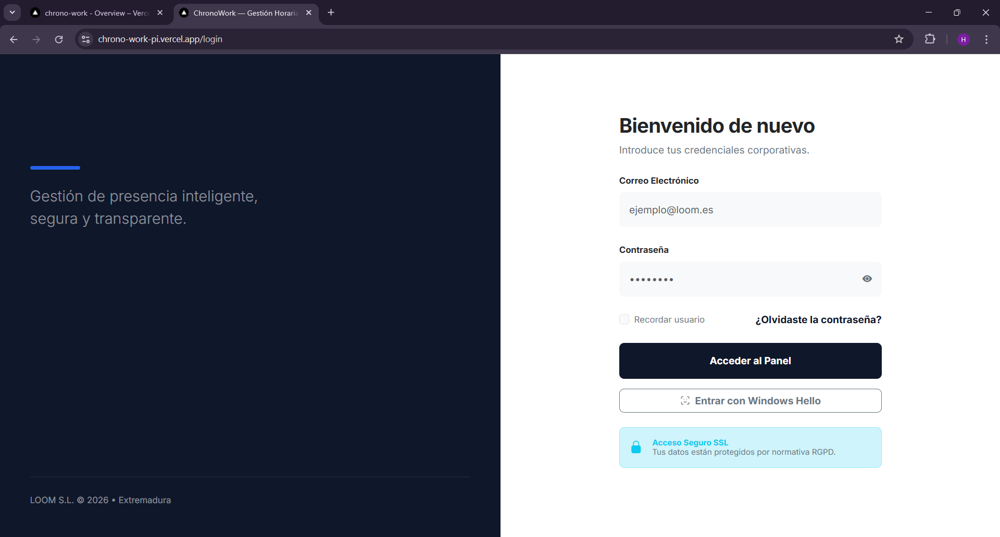

# 📘 Manual de Usuario - ChronoWork

Bienvenido a ChronoWork. Este manual tiene como objetivo guiar a cualquier usuario (empleado o administrador) en el uso de la aplicación, desde el inicio de sesión hasta la gestión de fichajes y panel de control.

---

## 1. Inicio de Sesión (Login)
Para acceder al sistema, el usuario debe introducir su correo electrónico y contraseña proporcionados por la empresa.

> **Figura 1:** Pantalla principal de acceso a la plataforma.

---

## 2. Vista de Empleado

El empleado tiene acceso a una interfaz simplificada centrada en su jornada diaria y perfil.

### 2.1. Panel de Fichaje
Desde esta pantalla, el empleado puede registrar su entrada y salida. El sistema verificará su ubicación por GPS para asegurarse de que está dentro del radio de la sede asignada.

*(  UNA CAPTURA DEL BOTÓN DE FICHAR O EL CRONÓMETRO)*
> **Figura 2:** Cronómetro y botones de registro de jornada.

### 2.2. Menú de Navegación Móvil
Si el usuario accede desde un smartphone, verá un menú inferior adaptado para facilitar la navegación con una sola mano.

*(  UNA CAPTURA DEL MENÚ INFERIOR EN VERSIÓN MÓVIL)*
> **Figura 3:** Menú de navegación inferior nativo para móviles.

---

## 3. Vista de Administrador (RRHH)

El administrador tiene acceso total al control de la plantilla, visualización del mapa y gestión de alertas.

### 3.1. Dashboard Principal
El panel de control muestra estadísticas en tiempo real con tarjetas vistosas indicando empleados activos, alertas y solicitudes pendientes.

*(  UNA CAPTURA DE TU DASHBOARD CON LAS TARJETAS DE COLORES)*
> **Figura 4:** Panel de control con métricas en tiempo real.

### 3.2. Directorio de Empleados
Lista completa del personal, permitiendo acciones rápidas como llamar por teléfono o enviar un email directamente haciendo clic en los iconos.

*(  UNA CAPTURA DE LA TABLA DE USUARIOS CON LOS ICONOS DE CONTACTO)*
> **Figura 5:** Gestión de empleados y acciones de contacto.

### 3.3. Mapa de Sedes y Geofencing
Visualización geográfica de los centros de trabajo. Los círculos indican el radio permitido para fichar. Los marcadores muestran los empleados activos en cada sede.

*(  UNA CAPTURA DEL MAPA CON LOS CÍRCULOS Y PINCHES)*
> **Figura 6:** Mapa de control de presencia por sedes.